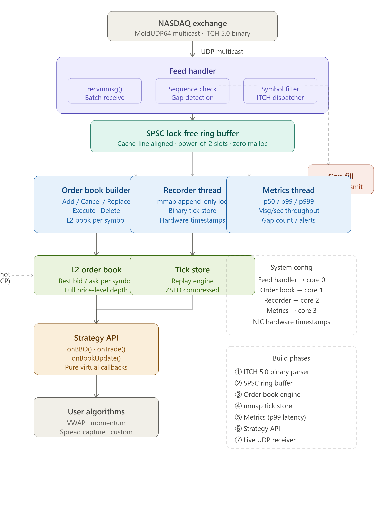

# MarketCapture

A C++20 low-latency market-data platform built to demonstrate exchange
protocols, deterministic recovery, concurrency, persistence, and performance
engineering for HFT-oriented systems roles.



## Hiring-grade differentiators

- Multi-symbol order books with stable shard routing
- A/B feed arbitration, duplicate suppression, gap blocking, and recovery callbacks
- Raw MoldUDP64 PCAP capture and deterministic offline playback
- Checksummed two-slot checkpoints with corrupt-generation fallback
- Seeded exchange simulator producing valid, reproducible order lifecycles
- ASan/UBSan CI, malformed-prefix tests, and libFuzzer targets
- Throughput and p50/p99/p99.9 end-to-end measurements
- Architecture, recovery, storage, and profiling design documents
- One-command showcase proving loss recovery and restart equivalence
- mmap append-only block storage using the real Zstandard runtime
- Linux `SO_TIMESTAMPING` receiver with hardware/software timestamp quality
- Optional DPDK burst source that strips Ethernet/IPv4/UDP into MoldUDP64 payloads
- Linux `recvmmsg` batching and optional fixed-buffer `io_uring` receive queues
- Versioned 128-byte FPGA DMA event ABI with acquire/release ownership
- Checksummed mmap/Zstd segment rotation with bounded retention
- Reproducible Linux evidence, profiling, feed-acceptance, and demo workflows
- Preallocated ingress pool with parser-to-book/recorder/metrics SPSC fan-out
- Fixed-width hot events, bounded circular arbitration, PMR arena books, and
  asynchronous PCAP persistence
- Official BinaryFile streaming validator with independent golden decoder
- Multishot io_uring provided buffers, CPU affinity, overload/watermark telemetry
- Runnable DPDK EAL/port harness and crash/soak evidence workflows

## Roadmap status

- [x] v0.1 — Repository structure
- [x] v0.2 — Complete NASDAQ ITCH 5.0 message parser
- [x] v0.3 — MoldUDP64 decoder
- [x] v0.4 — Lock-free SPSC ring buffer
- [x] v0.5 — Snapshot manager
- [x] v0.6 — Order-book reconstruction
- [x] v0.7 — Binary order-tick recorder
- [x] v0.8 — Deterministic replay engine
- [x] v0.9 — Metrics and performance benchmark
- [x] v1.0 — UDP multicast live market-data pipeline

## Features

- Strict parsing for all 22 NASDAQ TotalView-ITCH 5.0 message types
- Bounds-checked MoldUDP64 packet decoding with zero-copy message views
- Wait-free bounded SPSC event queue
- Price-level order-book reconstruction and depth snapshots
- Versioned binary tick recording and deterministic replay
- Atomic counters and latency timing
- End-to-end packet pipeline with sequence-gap detection
- Strategy callback API
- Cross-platform UDP multicast receiver
- Configurable live-capture executable with recording, gap/error metrics, and Ctrl+C shutdown
- CMake install target, example, tests, and Linux/Windows CI

The parser exposes normalized typed events for system, stock, trading-status,
participant, control, order, trade, auction, and retail-interest messages.
Unknown types and malformed lengths are rejected.

## Build

```sh
cmake -S . -B build -DCMAKE_BUILD_TYPE=Release
cmake --build build --config Release
ctest --test-dir build -C Release --output-on-failure
```

Run the small order-book example:

```sh
./build/marketcapture_demo
```

Run the release-mode microbenchmark (optional argument: iteration count):

```sh
./build/marketcapture_benchmark 1000000
```

Run the complete portfolio demonstration:

```sh
./build/marketcapture_showcase 10000 demo-output
```

Run the isolated threaded hot path:

```sh
./build/marketcapture_threaded 100000 threaded-output.ticks
```

The demo generates an A/B feed, independently drops packets on both channels,
captures PCAP, requests recovery, replays missing data, builds six symbol books,
writes a compressed mmap tick segment and checkpoint, restarts, and verifies
identical order/symbol counts.

Run a live licensed feed:

```sh
cp config/feed.conf.example feed.conf
# Replace the multicast, port, and interface values with provider-assigned values.
./build/marketcapture_live feed.conf
```

See [Exchange connectivity](docs/EXCHANGE_CONNECTIVITY.md) for deployment and
acceptance criteria.

Design and evidence:

- [Hiring-grade architecture](docs/architecture/hiring_grade_architecture.md)
- [A/B arbitration](docs/design/FeedArbitration.md)
- [Checkpoint recovery](docs/design/CheckpointRecovery.md)
- [PCAP replay](docs/design/PcapReplay.md)
- [Reference benchmark](docs/benchmarks/2026-07-25-reference.md)
- [Profiling and optimization notes](docs/benchmarks/profiling.md)
- [mmap Zstd store](docs/design/MmapZstdStore.md)
- [Hardware acceleration adapters](docs/design/HardwareAcceleration.md)
- [Storage rotation and retention](docs/design/StorageRetention.md)
- [Reproducible evidence workflow](docs/benchmarks/EVIDENCE.md)
- [Demo and resume narrative](docs/DEMO_AND_RESUME.md)
- [Threaded hot-path ownership and backpressure](docs/design/ThreadedHotPath.md)
- [Linux/DPDK runtime](docs/design/LinuxRuntime.md)
- [Official ITCH correctness report](docs/benchmarks/OFFICIAL_ITCH_REPORT.md)
- [Optimization report](docs/benchmarks/OPTIMIZATION_REPORT.md)
- [Interview guide](docs/INTERVIEW_GUIDE.md)

On multi-config Windows generators the executable is under `build/Release`.

## Basic use

```cpp
#include <marketcapture/itch.hpp>
#include <marketcapture/order_book.hpp>

marketcapture::ItchParser parser;
marketcapture::OrderBook book;

// message is one complete ITCH message obtained from a MoldUDP64 packet.
auto event = parser.parse(message);
book.apply(event);
```

`CapturePipeline` combines MoldUDP64 decoding, ITCH parsing, sequence-gap
tracking, metrics, and event delivery. A live application passes each UDP
datagram from `UdpLiveFeed` to the pipeline, then publishes normalized events
through `SpscRingBuffer` and updates one `OrderBook` per symbol. `TickRecorder`
can persist the same events and `ReplayEngine` delivers them back in recorded
order.

## Design constraints

- `MoldPacket::messages` are non-owning spans and remain valid only while the
  source datagram buffer remains alive.
- `SpscRingBuffer` supports exactly one producer and one consumer.
- `OrderBook` represents one symbol and rejects mixed-symbol or invalid order
  transitions. Informational ITCH events have no book effect.
- ITCH prices use the native four-decimal fixed-point representation.
- The recorder stores normalized order-impacting events; informational ITCH
  events are not order ticks and are intentionally rejected.
- The recorder format is versioned by its `MCAPTIK1` header. Files are intended
  for trusted local capture/replay workloads.
- Benchmark values are environment-specific and should be compared on pinned,
  equivalently configured hardware.
- Market-data entitlement and multicast network delivery are provisioned by the
  exchange or feed provider; they are not application passwords embedded in
  source code.
- Recovery callbacks define the ordering contract; vendor retransmission
  transport remains provider-specific.
- DPDK builds with `-DMARKETCAPTURE_ENABLE_DPDK=ON` and requires an initialized
  EAL port/queue. Physical NIC and FPGA claims require the target hardware.
- io_uring builds with `-DMARKETCAPTURE_ENABLE_IO_URING=ON` and `liburing-dev`.
- Licensed-feed proof requires provider entitlement and a routed market-data
  network; this repository supplies the receiver and acceptance script.

## License

MIT
